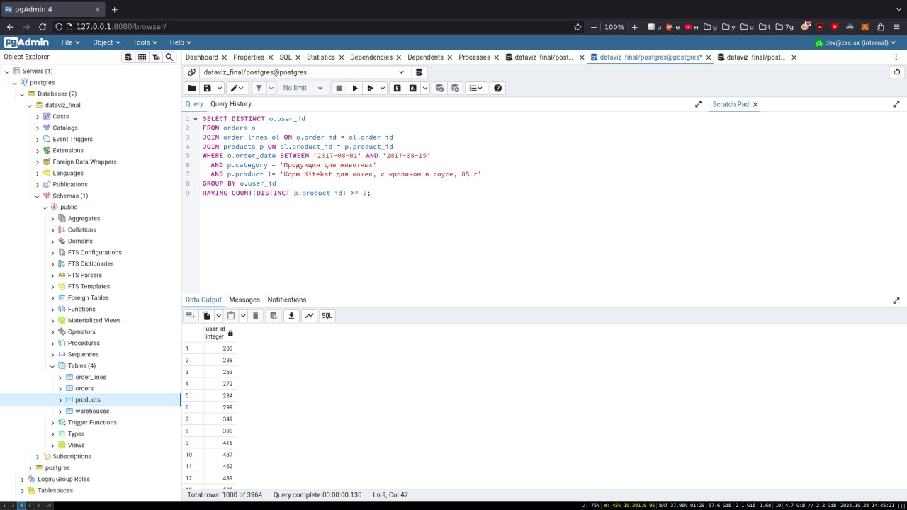
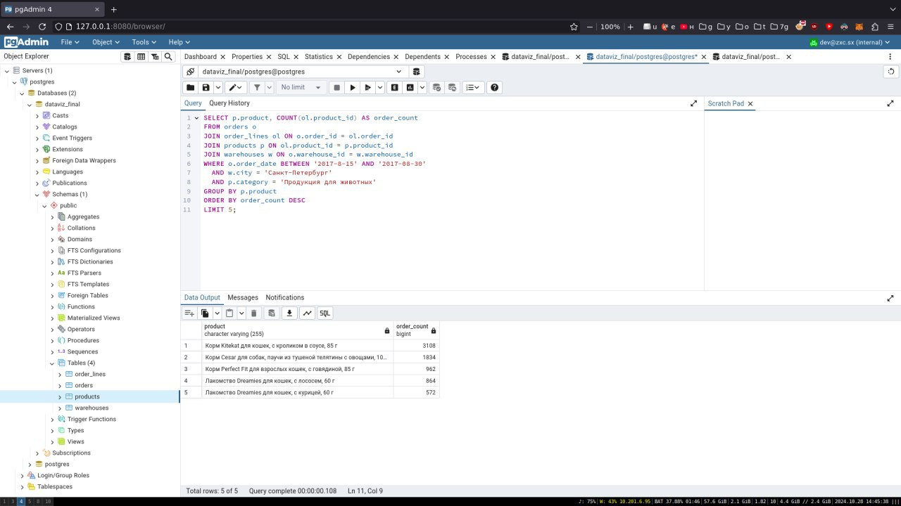

#### Task 1
In progress...

##### Tools and Environment
Data preparation was conducted using **PostgreSQL** and **PGAdmin**. PostgreSQL provided the database platform to handle structured data, while PGAdmin served as the graphical interface for database management and SQL command execution.

#### Data Preparation
In this data visualization task, three tables were created in PostgreSQL to structure the imported data from CSV files:

```sql
CREATE TABLE public.order_lines (
    order_id integer,
    product_id integer,
    price numeric(10,4),
    quantity integer
);

CREATE TABLE public.orders (
    order_date date,
    order_id integer,
    warehouse_id integer,
    user_id integer
);

CREATE TABLE public.products (
    product_id integer,
    product character varying(255),
    category character varying(255)
);
```

1. **order_lines**: Stores each order’s line items with `order_id`, `product_id`, `price`, and `quantity`.
2. **orders**: Records order information, including `order_date`, `warehouse_id`, and `user_id`.
3. **products**: Contains product information, including `product_id`, `product name`, and `category`.

Data was then imported using the `COPY` command:

```sql
COPY public.order_lines (order_id, product_id, price, quantity) FROM stdin;
47772	1929	110.2500	1
47772	3785	16.5000	1
47772	3967	39.0000	1
47772	5837	36.7500	1
```

#### Task 2
Write an SQL query on the database from task 1, which will display a list of those users who bought any animal feed for the period August 1-15, except "Kitekat cat food, with rabbit in sauce, 85 g". Attach it in a text document.

The following SQL query retrieves a list of users who purchased any animal feed products within the date range of August 1 to August 15, 2017, excluding the product *Kitekat cat food, with rabbit in sauce, 85 g*. The query uses joins between the `orders`, `order_lines`, and `products` tables to filter the data based on specific conditions:

1. **Date Range Filter**: Filters orders placed between August 1 and August 15, 2017.
2. **Category Filter**: Restricts products to the category "Animal Feed" (Продукция для животных).
3. **Product Exclusion**: Excludes any purchases of *Kitekat cat food, with rabbit in sauce, 85 g*.
4. **User Grouping and Uniqueness**: Groups by `user_id` to list each user only once and ensures that the user purchased at least two distinct products during the period.

```sql
SELECT DISTINCT o.user_id
FROM orders o
JOIN order_lines ol ON o.order_id = ol.order_id
JOIN products p ON ol.product_id = p.product_id
WHERE o.order_date BETWEEN '2017-08-01' AND '2017-08-15'
  AND p.category = 'Продукция для животных'
  AND p.product != 'Корм Kitekat для кошек, с кроликом в соусе, 85 г'
GROUP BY o.user_id
HAVING COUNT(DISTINCT p.product_id) >= 2;
```



#### Task 3
Write an SQL query that will display a list of the top 5 most common products in user orders in St. Petersburg for the period August 15-30. Attach it in the same text document where you wrote the request from the previous paragraph.

The SQL query below retrieves the top 5 most frequently ordered animal feed products by users in St. Petersburg for the period of August 15 to August 30, 2017. The query uses joins across the `orders`, `order_lines`, `products`, and `warehouses` tables to filter and aggregate data:

1. **Date Range Filter**: Selects orders within the period from August 15 to August 30, 2017.
2. **City Filter**: Restricts the search to orders fulfilled in warehouses located in St. Petersburg (Санкт-Петербург).
3. **Category Filter**: Limits the product selection to the category "Animal Feed" (Продукция для животных).
4. **Product Aggregation**: Groups results by `product` and counts each product’s occurrences in user orders to determine frequency.
5. **Top 5 Selection**: Orders the products by their `order_count` in descending order and limits the result to the top 5 most frequently ordered products.

```sql
SELECT p.product, COUNT(ol.product_id) AS order_count
FROM orders o
JOIN order_lines ol ON o.order_id = ol.order_id
JOIN products p ON ol.product_id = p.product_id
JOIN warehouses w ON o.warehouse_id = w.warehouse_id
WHERE o.order_date BETWEEN '2017-08-15' AND '2017-08-30'
  AND w.city = 'Санкт-Петербург'
  AND p.category = 'Продукция для животных'
GROUP BY p.product
ORDER BY order_count DESC
LIMIT 5;
```

